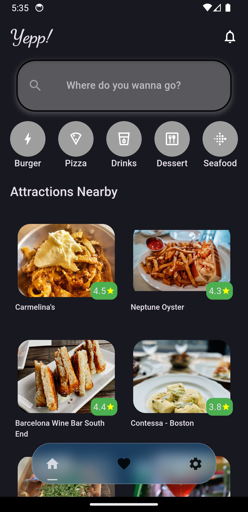

# yepp-app

## A Flutter app that showcase nearby restaurants.

# Features:
  - Clean architecture.
  - Bloc
  - Hive.
  - Firebase.
  - Go_router
  - Shared Preferences
    

# Roadmap:
  - Add location services.
  - Improve app functionality for better user integration.

## Getting Started
  0. Register your account and get a Yelp Fusion API at https://docs.developer.yelp.com/docs/.
  1. Clone the repository.
  2. Navigate to the project directory.
  3. Run flutter pub get to fetch the dependencies.
  4. Open the project in your preferred Flutter IDE.
  5. Create a const variable named <apiKey> and assign with your provided api key from Yelp.
  6. Run the app on your desired emulator or physical device.
